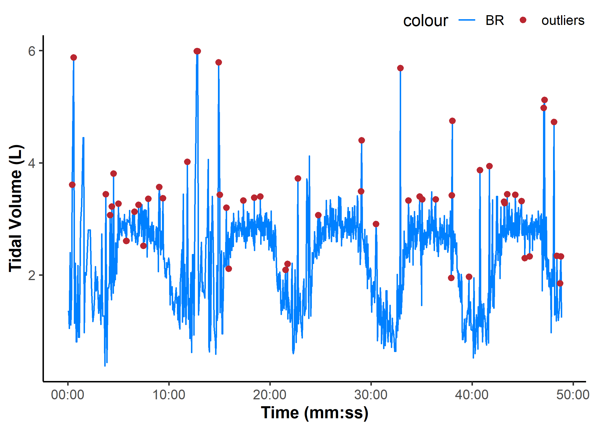

<!-- README.md is generated from README.Rmd. Please edit that file -->

# `{epl}` package

<!-- badges: start -->

<!-- badges: end -->

`{epl}` is a repository of functions and scripts for common tasks for
use by students in the UBC Environmental Physiology Laboratory.

## Online App

`<under development>`

## Installation

You can install the development version of `{epl}` from
[GitHub](https://github.com/jemarnold/epl) with:

``` r
# install.packages("remotes")
remotes::install_github("jemarnold/epl")
```

## Usage

#### `example_epl()`

This helper function can be used to retrieve example data files included
in {epl} to test processing functions.

``` r
library(tidyr, warn.conflicts = FALSE)
library(dplyr, warn.conflicts = FALSE) ## for data wrangling
library(ggplot2) ## for plotting
library(epl) ## load {epl} package

## set the script default {ggplot2} display theme (see below for details)
theme_set(theme_epl())

## calling `example_epl()` will return a list of all included example files
example_epl()
#> [1] "parvo_binned.CSV"  "parvo_bxb.CSV"     "tymewear_live.csv"
#> [4] "tymewear_post.csv"

## partial matching will error if matches multiple
example_epl("tymewear")
#> Error in `example_epl()`:
#> ! Multiple files match "tymewear":
#> ℹ Matching files: "tymewear_live.csv" and "tymewear_post.csv"

## calling a specific file by name will return the file path to that file
## partial string matching works for uniquely identifiable file names
example_epl("tymewear_live")
#> [1] "C:/Program Files/R/R-4.5.1/library/epl/extdata/tymewear_live.csv"
```

### `read_tymewear()`

This function will read *“Live Processed CSV”* or *“Post Processed CSV”*
files exported from *Tymewear VitalPro* and return a list of two data
frames with recorded data and file details.

- `tyme$data` contains the recorded raw data samples for breathing rate,
  tidal volume, and ventilation: `c("br", "vt", "ve")`, with time in
  seconds and timestamps in `datetime` format.

- `tyme$details` contains the file details & metadata, including
  `c("gender", "weight", "date", "app-start-time")`.

``` r
## specify the file path via any number of methods
## this gives an example format
file_path <- file.path("root_project_folder", "data_folder", "my_file.csv")
file_path
#> [1] "root_project_folder/data_folder/my_file.csv"

## example files are available by calling `example_epl()`
file_path <- example_epl("tymewear_live")

tymelive <- read_tymewear(file_path)
tymelive
#> $data
#> # A tibble: 1,083 × 5
#>     time timestamp              br    vt    ve
#>    <dbl> <dttm>              <dbl> <dbl> <dbl>
#>  1  0    2025-10-23 10:50:11  12.7  1.35    17
#>  2  4.14 2025-10-23 10:50:15  14.9  1.35    20
#>  3  7.95 2025-10-23 10:50:18  15    1.05    16
#>  4 13.0  2025-10-23 10:50:24  13.8  2.4     33
#>  5 17.2  2025-10-23 10:50:28  13.3  1.11    15
#>  6 21.2  2025-10-23 10:50:32  12.8  1.63    21
#>  7 25.7  2025-10-23 10:50:36  13    3.61    47
#>  8 33.9  2025-10-23 10:50:44  11.9  5.88    70
#>  9 39.3  2025-10-23 10:50:50   8    1.14     9
#> 10 44.7  2025-10-23 10:50:55  10    2.21    22
#> # ℹ 1,073 more rows
#> 
#> $details
#> # A tibble: 60 × 2
#>    ...1          ...2    
#>    <chr>         <chr>   
#>  1 Info Section  ""      
#>  2 type          "0"     
#>  3 stages        "[]"    
#>  4 gender        "Female"
#>  5 weight        "64.0"  
#>  6 weight_units  "SI"    
#>  7 activity-name "TW02"  
#>  8 f_v           "1.0"   
#>  9 activity-type "0"     
#> 10 sport         "2"     
#> # ℹ 50 more rows
```

### `read_parvo()`

This function will read *.CSV* or *.xlsx* (but not *.XLS*) files
exported by *Parvo Medics TrueOne 2400* and return a list of three data
frames with recorded data, file details, and events.

- `parvo$data` contains the recorded raw data samples for exported data
  channels (e.g. `c("VO2", "VCO2", "RR", "Vt")`) and calculated
  metabolic values (e.g. `c("O2kJ", "O2kcal", "Paer", "METS")`; see
  `?read_parvo` for details on calculated values).

- `parvo$details` contains the file details & metadata, including
  `c("Date", "Name", "Sex", "Age")` (all metric values).

- `parvo$events` contains any manually entered events with `"TIME"` in
  seconds and event descriptions.

``` r
## example files are available by calling `example_epl()`
file_path <- example_epl("parvo_binned")

parvo <- read_parvo(file_path)
parvo
#> $data
#> # A tibble: 179 × 25
#>     TIME    HR VO2kg   VO2  VCO2   RER    RR    Vt    VE VEVO2 VEVCO2  FEO2
#>    <dbl> <dbl> <dbl> <dbl> <dbl> <dbl> <dbl> <dbl> <dbl> <dbl>  <dbl> <dbl>
#>  1  18.1     0  5.69 0.404 0.419 1.04   13.3 1.11  12.1   36.5   35.2  17.6
#>  2  31.5     0  6.80 0.483 0.484 1.00   17.8 0.993 14.5   36.7   36.6  17.6
#>  3  49.5   107  6.08 0.432 0.448 1.04   10.0 1.66  13.6   38.4   37.0  17.7
#>  4  62.5   107  4.06 0.288 0.321 1.11   13.8 0.816  9.27  39.2   35.2  17.7
#>  5  77.5   107  8.61 0.611 0.648 1.06   16.0 1.28  16.8   33.4   31.5  17.2
#>  6  94.9   107  7.52 0.534 0.528 0.990  13.8 1.15  13.0   29.8   30.1  16.8
#>  7 107.    107  6.80 0.483 0.514 1.06   15.0 1.10  13.6   34.2   32.1  17.3
#>  8 123.    107  5.94 0.422 0.454 1.08   11.2 1.33  12.2   35.2   32.7  17.4
#>  9 138.    107  2.47 0.175 0.186 1.06   16.0 0.392  5.13  35.7   33.6  17.5
#> 10 153.    107  3.92 0.278 0.294 1.06   12.1 0.845  8.42  36.9   34.9  17.6
#> # ℹ 169 more rows
#> # ℹ 13 more variables: FECO2 <dbl>, FATmin <dbl>, CHOmin <dbl>, Breath <dbl>,
#> #   FatOx <dbl>, CarbOx <dbl>, O2kJ <dbl>, O2kcal <dbl>, O2work <dbl>,
#> #   O2energy <dbl>, O2power <dbl>, O2pulse <dbl>, METS <dbl>
#> 
#> $details
#> # A tibble: 1 × 16
#>   Date             Name  Sex     Age Height Weight `Insp. temp` `Baro. pressure`
#>   <chr>            <chr> <chr> <dbl>  <dbl>  <dbl>        <dbl>            <dbl>
#> 1 2025-10-23 10:5… TW02  Male      0    176     71         23.6             755.
#> # ℹ 8 more variables: `Insp. humidity` <dbl>, `STPD to BTPS` <dbl>,
#> #   `O2 Gain` <dbl>, `CO2 Gain` <dbl>, `Base O2` <dbl>, `Base CO2` <dbl>,
#> #   `Measured O2` <dbl>, `Measured CO2` <dbl>
#> 
#> $events
#> # A tibble: 23 × 2
#>     TIME Events        
#>    <dbl> <chr>         
#>  1   240 Start Exercise
#>  2   240 UP1 265W      
#>  3   540 Stop Exercise 
#>  4   540 Cadence 95    
#>  5   900 Start Exercise
#>  6   900 RP2 265W      
#>  7  1200 Stop Exercise 
#>  8  1200 RPE 6-20 15   
#>  9  1200 Cadence 95    
#> 10  1440 Start Exercise
#> # ℹ 13 more rows
```

`read_parvo()` has an argument to add timestamps in `datetime` format to
`parvo$data`, taken from `parvo$details` file start time. This is
recorded from system time to the nearest whole second (i.e. precise to ±
0.5 sec, assuming system time is accurate).

``` r
## timestamps can be added
read_parvo(file_path, add_timestamp = TRUE)$data
#> # A tibble: 179 × 26
#>     TIME timestamp              HR VO2kg   VO2  VCO2   RER    RR    Vt    VE
#>    <dbl> <dttm>              <dbl> <dbl> <dbl> <dbl> <dbl> <dbl> <dbl> <dbl>
#>  1  18.1 2025-10-23 10:50:23     0  5.69 0.404 0.419 1.04   13.3 1.11  12.1 
#>  2  31.5 2025-10-23 10:50:36     0  6.80 0.483 0.484 1.00   17.8 0.993 14.5 
#>  3  49.5 2025-10-23 10:50:54   107  6.08 0.432 0.448 1.04   10.0 1.66  13.6 
#>  4  62.5 2025-10-23 10:51:07   107  4.06 0.288 0.321 1.11   13.8 0.816  9.27
#>  5  77.5 2025-10-23 10:51:22   107  8.61 0.611 0.648 1.06   16.0 1.28  16.8 
#>  6  94.9 2025-10-23 10:51:39   107  7.52 0.534 0.528 0.990  13.8 1.15  13.0 
#>  7 107.  2025-10-23 10:51:51   107  6.80 0.483 0.514 1.06   15.0 1.10  13.6 
#>  8 123.  2025-10-23 10:52:08   107  5.94 0.422 0.454 1.08   11.2 1.33  12.2 
#>  9 138.  2025-10-23 10:52:23   107  2.47 0.175 0.186 1.06   16.0 0.392  5.13
#> 10 153.  2025-10-23 10:52:37   107  3.92 0.278 0.294 1.06   12.1 0.845  8.42
#> # ℹ 169 more rows
#> # ℹ 16 more variables: VEVO2 <dbl>, VEVCO2 <dbl>, FEO2 <dbl>, FECO2 <dbl>,
#> #   FATmin <dbl>, CHOmin <dbl>, Breath <dbl>, FatOx <dbl>, CarbOx <dbl>,
#> #   O2kJ <dbl>, O2kcal <dbl>, O2work <dbl>, O2energy <dbl>, O2power <dbl>,
#> #   O2pulse <dbl>, METS <dbl>
```

### `replace_outliers()`

This function can detect and replace local outliers in vector data with
either `NA` or the local median value, within a window defined by
`width`.

`width = 7` (sample window = `-7 < idx < 7`) seems suitable for
breath-by-breath ventilatory data, however this can be modified
depending on your data and to suit your desired response signal.

See `?replace_outliers` for more information.

``` r

tyme_data <- tymelive$data
## filter breathing rate vector data for local outliers
vt_filtered <- replace_outliers(tyme_data$vt, width = 7, method = "median")

## plot raw signal and highlight outliers (see below for custom ggplot2 functions)
ggplot(tyme_data) +
    aes(x = time, y = vt) +
    ylab("Tidal Volume (L)") +
    scale_x_continuous(
        name = "Time (mm:ss)",
        breaks = breaks_timespan(),
        labels = format_hmmss
    ) +
    scale_colour_epl() +
    geom_line(aes(colour = "BR")) +
    geom_point(
        data = slice(tyme_data, which(vt_filtered != vt)),
        aes(y = vt, colour = "outliers"))
```



``` r

## to replace outliers from all channels in a data frame
tyme_clean <- tyme_data |> 
    mutate(
        across(c(br, vt, ve), \(.x) replace_outliers(.x, 7))
    )

## check relative (%) effect of removing outliers on signal SD
1 - sd(tyme_clean$vt) / sd(tyme_data$vt)
#> [1] 0.08497033

## and on sample noise
1 - mean(abs(diff(tyme_clean$vt))) / mean(abs(diff(tyme_data$vt)))
#> [1] 0.2466022
```

### `theme_epl()` & custom `{ggplot2}` plotting functions

This package includes a clean plot template and colour palette for
`{ggplot2}`, the data visualisation engine of choice in R. We have
already seen the basics of what it looks like.

The key function is `theme_epl()`, which can be called at the top of a
script with `theme_set(theme_epl())` (as we have done at the top of this
page) to set our plot defaults. Or it can be called within an individual
plot, as below. See `?theme_epl` for details.

``` r
parvo_data <- parvo$data

## explore what each setting does to the aesthetics of the plot
ggplot(parvo_data) +
    aes(x = TIME) +
    coord_cartesian(ylim = c(0, NA)) + ## set plot x- & y-axis limits
    theme(
        panel.grid.major.y = element_line() ## modify the current theme
    ) +
    scale_x_continuous( ## parameters for the x-axis
        name = "Time (mm:ss)",
        breaks = breaks_timespan(), ## pretty time x-axis formatting
        labels = format_hmmss ## pretty time x-axis formatting (see below)
    ) +
    scale_y_continuous( ## parameters for the y-axis
        name = "VO2  |  VCO2 (L/min)",
        expand = expansion(mult = 0) ## adjust space above/below max/min
    ) +
    scale_colour_manual( ## set the colour mapping
        name = NULL,
        aesthetics = c("colour", "fill"), ## for both colour & fill
        values = setNames(palette_epl()[c(6, 5)], c("VO2", "VCO2")), ## set custom colours (see below)
    ) +
    guides(
        colour = guide_legend(override.aes = list(alpha = 1)) ## modify the legend keys)
    ) +
    geom_area(aes(y = VO2, colour = "VO2", fill = "VO2"), 
              alpha = 0.1, key_glyph = "path") +
    geom_line(aes(y = VCO2, colour = "VCO2"))
```


`palette_epl()` includes some nice colours which can be called
individually with `scale_colour_manual(values = palette_epl()[1:2])`, or
as a default palette built into `scale_colour_epl()` (used in the two
plots above). See `?scale_colour_epl` for more options.

``` r
scales::show_col(palette_epl()) ## visualise the colour palette
```


Time values on the x-axis can be displayed in *“h:mm:ss”* units with
`format_hmmss()`, and breaks set to pretty time-ish values
(e.g. 60-second or 5-minute (300 sec) increments) with
`breaks_timespan()`, as used in the plots above.

### `filter_data()`

`<under development>`

### `detect_peaks()`

`<under development>`

## To do

- Create vignette for main package usage.

- Update EPL Parvo App.

- Update `read_tymewear()` method for *“tymepost*” export file type.

- Add mean peak value detection, i.e. for V̇O<sub>2</sub>peak.

- Add digital filtering methods (e.g. Butterworth, smoothing spline,
  simple moving average, binning).

- Add 4-parameter monoexponential curve fitting via `nls()`
  self-starting functions.

- ~~Add template display theme for `ggplot2` plotting.~~

- ~~Add local outlier filtering for metabolic data.~~
