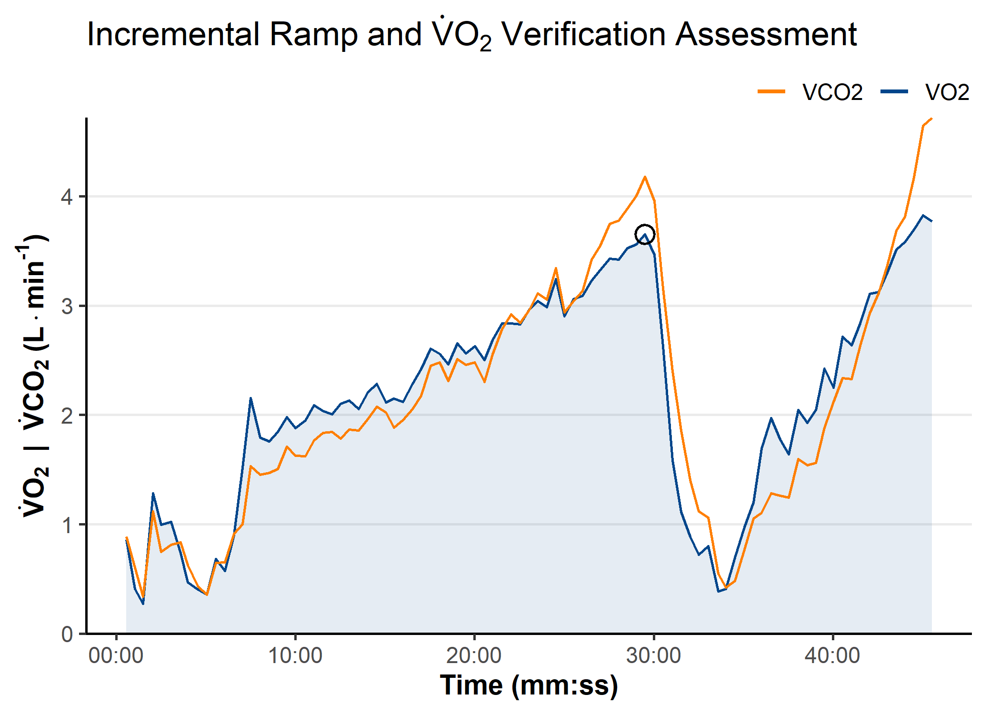

<!-- README.md is generated from README.Rmd. Please edit that file -->

# epl

<!-- badges: start -->

[](https://lifecycle.r-lib.org/articles/stages.html#experimental)
[](https://github.com/jemarnold/epl/actions/workflows/R-CMD-check.yaml)
[](https://app.codecov.io/gh/jemarnold/epl)
<!-- badges: end -->

*{epl}* is a repository of functions and scripts for common tasks for
use by students in the UBC Environmental Physiology Laboratory.

## Website

For more information and vignettes on usage, please visit [the package
website](https://jemarnold.github.io/epl/).

## Online App

A rudimentary implementation of some of the *{epl}* functions are
available as [a *Shiny* app](jem-arnold.shinyapps.io/EPL-Parvo-App/) to
read, clean, plot, and download Parvo metabolic data.

## Installation

You can install the development version of *{epl}* from
[GitHub](https://github.com/jemarnold/epl) with:

``` r
## install.packages("remotes")
remotes::install_github("jemarnold/epl")
```

## Usage

``` r
library(tidyr, warn.conflicts = FALSE)
library(dplyr, warn.conflicts = FALSE)
library(ggplot2)
library(epl)

theme_set(theme_epl())
```

#### `example_epl()`

This helper function can be used to retrieve example data files included
in *{epl}* to test processing functions.

``` r
example_epl()
#> [1] "parvo_binned.CSV"  "parvo_bxb.CSV"     "tymewear_live.csv"
#> [4] "tymewear_post.csv"

example_epl("parvo_binned")
#> [1] "C:/Program Files/R/R-4.5.1/library/epl/extdata/tymewear_live.csv"
```

### `read_parvo()`

``` r
parvo <- read_parvo(example_epl("parvo_binned"), add_timestamp = TRUE)
parvo
#> $data
#> # A tibble: 179 × 26
#>     TIME timestamp              HR VO2kg   VO2  VCO2   RER    RR    Vt    VE
#>    <dbl> <dttm>              <dbl> <dbl> <dbl> <dbl> <dbl> <dbl> <dbl> <dbl>
#>  1  18.1 2025-10-23 10:50:23     0  5.69 0.404 0.419 1.04   13.3 1.11  12.1 
#>  2  31.5 2025-10-23 10:50:36     0  6.80 0.483 0.484 1.00   17.8 0.993 14.5 
#>  3  49.5 2025-10-23 10:50:54   107  6.08 0.432 0.448 1.04   10.0 1.66  13.6 
#>  4  62.5 2025-10-23 10:51:07   107  4.06 0.288 0.321 1.11   13.8 0.816  9.27
#>  5  77.5 2025-10-23 10:51:22   107  8.61 0.611 0.648 1.06   16.0 1.28  16.8 
#>  6  94.9 2025-10-23 10:51:39   107  7.52 0.534 0.528 0.990  13.8 1.15  13.0 
#>  7 107.  2025-10-23 10:51:51   107  6.80 0.483 0.514 1.06   15.0 1.10  13.6 
#>  8 123.  2025-10-23 10:52:08   107  5.94 0.422 0.454 1.08   11.2 1.33  12.2 
#>  9 138.  2025-10-23 10:52:23   107  2.47 0.175 0.186 1.06   16.0 0.392  5.13
#> 10 153.  2025-10-23 10:52:37   107  3.92 0.278 0.294 1.06   12.1 0.845  8.42
#> # ℹ 169 more rows
#> # ℹ 16 more variables: VEVO2 <dbl>, VEVCO2 <dbl>, FEO2 <dbl>, FECO2 <dbl>,
#> #   FATmin <dbl>, CHOmin <dbl>, Breath <dbl>, FatOx <dbl>, CarbOx <dbl>,
#> #   O2kJ <dbl>, O2kcal <dbl>, O2work <dbl>, O2energy <dbl>, O2power <dbl>,
#> #   O2pulse <dbl>, METS <dbl>
#> 
#> $details
#> # A tibble: 1 × 16
#>   Date             Name  Sex     Age Height Weight `Insp. temp` `Baro. pressure`
#>   <chr>            <chr> <chr> <dbl>  <dbl>  <dbl>        <dbl>            <dbl>
#> 1 2025-10-23 10:5… TW02  Male      0    176     71         23.6             755.
#> # ℹ 8 more variables: `Insp. humidity` <dbl>, `STPD to BTPS` <dbl>,
#> #   `O2 Gain` <dbl>, `CO2 Gain` <dbl>, `Base O2` <dbl>, `Base CO2` <dbl>,
#> #   `Measured O2` <dbl>, `Measured CO2` <dbl>
#> 
#> $events
#> # A tibble: 23 × 2
#>     TIME Events        
#>    <dbl> <chr>         
#>  1   240 Start Exercise
#>  2   240 UP1 265W      
#>  3   540 Stop Exercise 
#>  4   540 Cadence 95    
#>  5   900 Start Exercise
#>  6   900 RP2 265W      
#>  7  1200 Stop Exercise 
#>  8  1200 RPE 6-20 15   
#>  9  1200 Cadence 95    
#> 10  1440 Start Exercise
#> # ℹ 13 more rows
```

### `read_tymewear()`

``` r
tymelive <- read_tymewear(example_epl("tymewear_live"))
tymelive
#> $data
#> # A tibble: 1,083 × 5
#>     time timestamp              br    vt    ve
#>    <dbl> <dttm>              <dbl> <dbl> <dbl>
#>  1  0    2025-10-23 10:50:11  12.7  1.35    17
#>  2  4.14 2025-10-23 10:50:15  14.9  1.35    20
#>  3  7.95 2025-10-23 10:50:18  15    1.05    16
#>  4 13.0  2025-10-23 10:50:24  13.8  2.4     33
#>  5 17.2  2025-10-23 10:50:28  13.3  1.11    15
#>  6 21.2  2025-10-23 10:50:32  12.8  1.63    21
#>  7 25.7  2025-10-23 10:50:36  13    3.61    47
#>  8 33.9  2025-10-23 10:50:44  11.9  5.88    70
#>  9 39.3  2025-10-23 10:50:50   8    1.14     9
#> 10 44.7  2025-10-23 10:50:55  10    2.21    22
#> # ℹ 1,073 more rows
#> 
#> $details
#> # A tibble: 60 × 2
#>    parameter     value   
#>    <chr>         <chr>   
#>  1 Info Section  ""      
#>  2 type          "0"     
#>  3 stages        "[]"    
#>  4 gender        "Female"
#>  5 weight        "64.0"  
#>  6 weight_units  "SI"    
#>  7 activity-name "TW02"  
#>  8 f_v           "1.0"   
#>  9 activity-type "0"     
#> 10 sport         "2"     
#> # ℹ 50 more rows
```

### `replace_outliers()`

``` r
tyme_data <- tymelive$data

vt_filtered <- replace_outliers(tyme_data$vt, width = 7, method = "median")

ggplot(tyme_data) +
    aes(x = time, y = vt) +
    ylab("Tidal Volume (L)") +
    scale_x_continuous(
        name = "Time (mm:ss)",
        breaks = breaks_timespan(),
        labels = format_hmmss
    ) +
    scale_colour_epl() +
    geom_line(aes(colour = "BR")) +
    geom_point(
        data = slice(tyme_data, which(vt_filtered != vt)),
        aes(y = vt, colour = "outliers")
    )
```


### `filter_data()`

`<under development>`

### `find_peaks()`

``` r
ramp_data <- read_parvo(example_epl("parvo_ramp"))$data

peak_data <- find_peaks(
    ramp_data, 
    x = "TIME",
    y = "VO2", 
    span = 30,
    between = c(1500, 2000)
)
peak_data
#> # A tibble: 1 × 25
#>   samples  TIME    HR VO2kg   VO2  VCO2   RER    RR    Vt    VE VEVO2 VEVCO2
#>     <int> <dbl> <dbl> <dbl> <dbl> <dbl> <dbl> <dbl> <dbl> <dbl> <dbl>  <dbl>
#> 1       1 1770.   222  49.9  3.65  4.18  1.14  46.7  2.88  110.  36.8   32.1
#> # ℹ 13 more variables: FEO2 <dbl>, FECO2 <dbl>, FATmin <dbl>, CHOmin <dbl>,
#> #   FatOx <dbl>, CarbOx <dbl>, O2kJ <dbl>, O2kcal <dbl>, O2work <dbl>,
#> #   O2energy <dbl>, O2power <dbl>, O2pulse <dbl>, METS <dbl>

VO2peak <- peak_data$VO2kg
VO2peak
#> [1] 49.94765
```

### `theme_epl()` & custom `{ggplot2}` plotting functions

``` r

ggplot(ramp_data) +
    aes(x = TIME) +
    labs(title = expression(
        Incremental~Ramp~and~dot(V)*O['2']~Verification~Assessment
    )) +
    coord_cartesian(ylim = c(0, NA)) +
    theme(
        panel.grid.major.y = element_line()
    ) +
    scale_x_continuous(
        name = "Time (mm:ss)",
        breaks = breaks_timespan(),
        labels = format_hmmss
    ) +
    scale_y_continuous(
        name = expression(bold(
            dot(V)*O['2']~~'|'~~dot(V)*CO['2']~'('*L%.%min^'-1'*')'
        )),
        expand = expansion(mult = 0)
    ) +
    scale_colour_manual(
        name = NULL,
        aesthetics = c("colour", "fill"),
        values = setNames(palette_epl()[c(6, 5)], c("VO2", "VCO2")),
    ) +
    guides(
        colour = guide_legend(override.aes = list(
            linewidth = 1, alpha = 1
        ))
    ) +
    geom_area(aes(y = VO2, colour = "VO2", fill = "VO2"), 
              alpha = 0.1, key_glyph = "path") +
    geom_line(aes(y = VCO2, colour = "VCO2")) +
    geom_point(data = peak_data, aes(x = TIME, y = VO2),
               size = 4, shape = 21, stroke = 1)
```



``` r
scales::show_col(palette_epl())
```


## To do (as of `0.2.0`)

- Add digital filtering methods (e.g. Butterworth, smoothing spline,
  simple moving average, binning).

- Update EPL Parvo App.

- Create vignette for main package usage.

- Update `read_tymewear()` method for *“tymepost*” export file type.

- Add 4-parameter monoexponential curve fitting via `nls()`
  self-starting functions.

- ~~Add mean peak value detection, i.e. for V̇O<sub>2</sub>peak.~~

- ~~Add template display theme for `ggplot2` plotting.~~

- ~~Add local outlier filtering for metabolic data.~~
