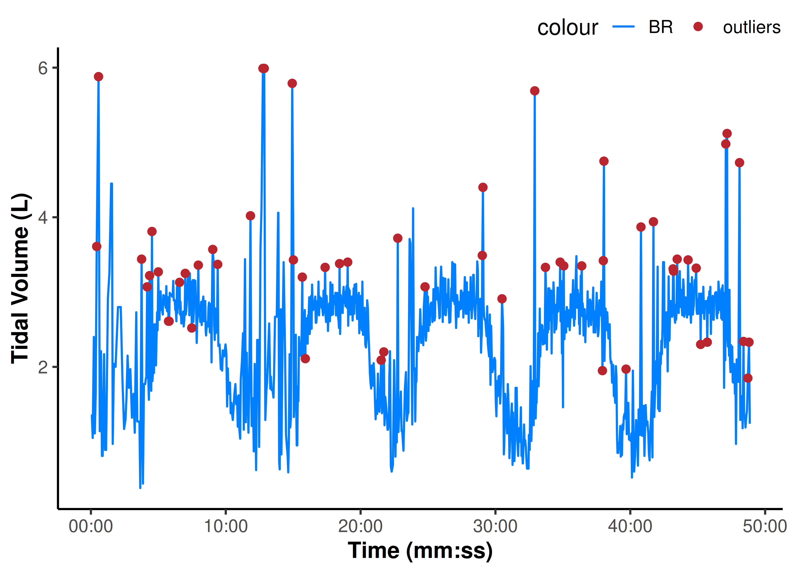
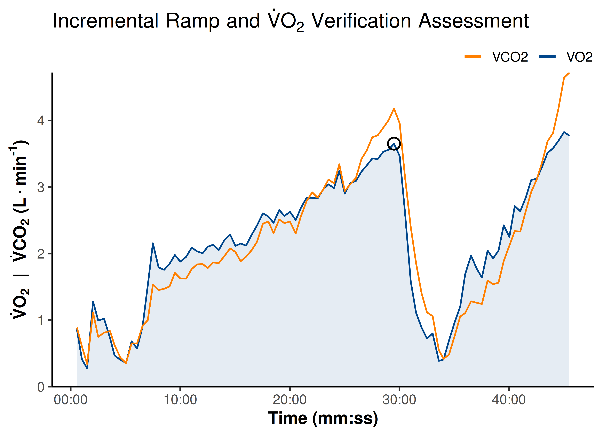
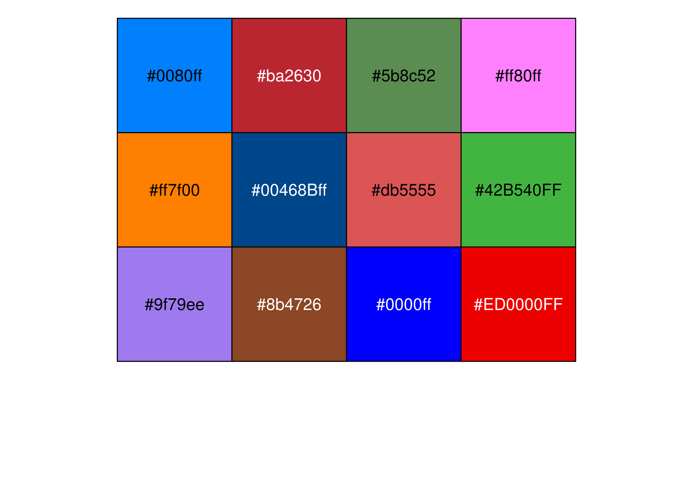

# Reading and Cleaning Data

Often the first common task we have to do is read our data from a file
exported from one of our lab devices into R. This package has a few
functions to make that task a bit easier.

In this vignette we will learn:

- To read files exported from *Parvo Medics TrueOne 2400* metabolic cart
  and *Tymewear Vital Pro* ventilation chest strap with
  [`read_parvo()`](https://jemarnold.github.io/epl/reference/read_parvo.md)
  and
  [`read_tymewear()`](https://jemarnold.github.io/epl/reference/read_tymewear.md),
  respectively.

- To detect and replace local outlier values in metabolic data with
  [`replace_outliers()`](https://jemarnold.github.io/epl/reference/replace_outliers.md).

- To calculate peak values (e.g. V̇O₂peak\`.

- Plotting functions for pretty data visualision with
  [`theme_epl()`](https://jemarnold.github.io/epl/reference/theme_epl.md),
  [`palette_epl()`](https://jemarnold.github.io/epl/reference/palette_epl.md),
  and other [ggplot2](https://ggplot2.tidyverse.org) helper functions.

- To perform digital filtering of metabolic data
  `<under development as of 0.2.0>`.

> **{epl} 0.2.0 internal release notes:**
>
> More functions will be added to this vignette as they are included in
> *{epl}*.

First we will set up our R environment by calling the package libraries
we will use.

``` r
library(tidyr) ## for data wrangling
library(dplyr) ## for data wrangling
library(ggplot2) ## for plotting
library(epl) ## this package

## set the script default {ggplot2} display theme (see below for details)
theme_set(theme_epl())
```

## Specify file path

------------------------------------------------------------------------

There are a few ways to point to our data file. If our data files and R
script are in the same root folder (or Rstudio project folder), then we
should be able to use an implicit file path, e.g.:
`"./raw_data/my_file.csv"`.

If the data file is elsewhere, we will need to define the full path
explicitly, e.g.:

``` r
file.path("~", "my_folder", "raw_data", "my_file.csv")
#> [1] "~/my_folder/raw_data/my_file.csv"
```

------------------------------------------------------------------------

### `example_epl()`

*{epl}* includes example data files which can be used to test the
included functions:

``` r
## calling `example_epl()` will return a list of all included example files
example_epl()
#> [1] "parvo_binned.CSV"  "parvo_bxb.CSV"     "parvo_ramp.CSV"
#> [4] "tymewear_live.csv" "tymewear_post.csv"

## partial matching will error if matches multiple
example_epl("parvo")
#> Error in `example_epl()`:
#> ! Multiple files match "parvo":
#> ℹ Matching files: "parvo_binned.CSV", "parvo_bxb.CSV", "parvo_excel.xlsx", and
#>   "parvo_ramp.CSV"

## calling a specific file by name will return the file path
## partial string matching works for uniquely identifiable file names
file_path <- example_epl("parvo_binned")
file_path
#> [1] "C:/Program Files/R/R-4.5.1/library/epl/extdata/parvo_binned.csv"
```

## Reading file data

------------------------------------------------------------------------

### `read_parvo()`

This function will read *.CSV* or *.xlsx* (but not *.XLS*) files
exported by *Parvo Medics TrueOne 2400* metabolic cart.

> **[`read_parvo()`](https://jemarnold.github.io/epl/reference/read_parvo.md)
> won’t work on exported *.XSL* data**
>
> The exported *.XSL* file format is obsolete and cannot be easily read
> into R. These files will need to be re-saved as *.xlsx* before being
> read. We recommend exporting as *.CSV* for this reason.

[`read_parvo()`](https://jemarnold.github.io/epl/reference/read_parvo.md)
has two simple arguments:

- `file_path`: takes in the character string for our data file path, as
  we defined above.

- `add_timestamp`: gives the option to add a timestamp (time of day)
  column in `datetime` format based on the file recording start time.
  The file start time is accurate to the nearest second (± 0.5 sec
  precision) **as long as the Parvo system time was accurate in the
  first place**. Which is not always true.

The output of this function is a list of three data frames:

- `parvo$data`: contains the recorded raw data samples for exported data
  channels (e.g. `c("VO2", "VCO2", "RR", "Vt")`) and calculated
  metabolic values (e.g. `c("O2kJ", "O2kcal", "Paer", "METS")`; see
  [`?read_parvo`](https://jemarnold.github.io/epl/reference/read_parvo.md)
  for details on calculated values).

- `parvo$details`: contains the file details & metadata, including
  `c("Date", "Name", "Sex", "Age")` (metric SI units only).

- `parvo$events`: contains any manually entered events with time in
  seconds and event descriptions.

``` r
parvo <- read_parvo(file_path = file_path, add_timestamp = TRUE)
parvo
#> $data
#> # A tibble: 179 × 26
#>     TIME timestamp              HR VO2kg   VO2  VCO2   RER    RR    Vt    VE
#>    <dbl> <dttm>              <dbl> <dbl> <dbl> <dbl> <dbl> <dbl> <dbl> <dbl>
#>  1  18.1 2025-10-23 10:50:23     0  5.69 0.404 0.419 1.04   13.3 1.11  12.1 
#>  2  31.5 2025-10-23 10:50:36     0  6.80 0.483 0.484 1.00   17.8 0.993 14.5 
#>  3  49.5 2025-10-23 10:50:54   107  6.08 0.432 0.448 1.04   10.0 1.66  13.6 
#>  4  62.5 2025-10-23 10:51:07   107  4.06 0.288 0.321 1.11   13.8 0.816  9.27
#>  5  77.5 2025-10-23 10:51:22   107  8.61 0.611 0.648 1.06   16.0 1.28  16.8 
#>  6  94.9 2025-10-23 10:51:39   107  7.52 0.534 0.528 0.990  13.8 1.15  13.0 
#>  7 107.  2025-10-23 10:51:51   107  6.80 0.483 0.514 1.06   15.0 1.10  13.6 
#>  8 123.  2025-10-23 10:52:08   107  5.94 0.422 0.454 1.08   11.2 1.33  12.2 
#>  9 138.  2025-10-23 10:52:23   107  2.47 0.175 0.186 1.06   16.0 0.392  5.13
#> 10 153.  2025-10-23 10:52:37   107  3.92 0.278 0.294 1.06   12.1 0.845  8.42
#> # ℹ 169 more rows
#> # ℹ 16 more variables: VEVO2 <dbl>, VEVCO2 <dbl>, FEO2 <dbl>, FECO2 <dbl>,
#> #   FATmin <dbl>, CHOmin <dbl>, Breath <dbl>, FatOx <dbl>, CarbOx <dbl>,
#> #   O2kJ <dbl>, O2kcal <dbl>, O2work <dbl>, O2energy <dbl>, O2power <dbl>,
#> #   O2pulse <dbl>, METS <dbl>
#> 
#> $details
#> # A tibble: 1 × 16
#>   Date             Name  Sex     Age Height Weight `Insp. temp` `Baro. pressure`
#>   <chr>            <chr> <chr> <dbl>  <dbl>  <dbl>        <dbl>            <dbl>
#> 1 2025-10-23 10:5… TW02  Male      0    176     71         23.6             755.
#> # ℹ 8 more variables: `Insp. humidity` <dbl>, `STPD to BTPS` <dbl>,
#> #   `O2 Gain` <dbl>, `CO2 Gain` <dbl>, `Base O2` <dbl>, `Base CO2` <dbl>,
#> #   `Measured O2` <dbl>, `Measured CO2` <dbl>
#> 
#> $events
#> # A tibble: 23 × 2
#>     TIME Events        
#>    <dbl> <chr>         
#>  1   240 Start Exercise
#>  2   240 UP1 265W      
#>  3   540 Stop Exercise 
#>  4   540 Cadence 95    
#>  5   900 Start Exercise
#>  6   900 RP2 265W      
#>  7  1200 Stop Exercise 
#>  8  1200 RPE 6-20 15   
#>  9  1200 Cadence 95    
#> 10  1440 Start Exercise
#> # ℹ 13 more rows
```

------------------------------------------------------------------------

### `read_tymewear()`

This function will read *“Live Processed CSV”* or *“Post Processed CSV”*
files exported from *Tymewear VitalPro* chest strap.

[`read_tymewear()`](https://jemarnold.github.io/epl/reference/read_tymewear.md)
only has one argument:

- `file_path`: as above, the character string for our file path.

The output of this function is a list of two data frames:

- `tyme$data`: contains the recorded raw data samples for breathing
  rate, tidal volume, and ventilation: `c("br", "vt", "ve")`, with time
  in seconds and timestamps in `datetime` format.

- `tyme$details`: contains the file details & metadata, including
  `c("gender", "weight", "date", "app-start-time")`. It is in “long”
  format, whereas the parvo details are in “wide” format.

``` r
tymelive <- read_tymewear(example_epl("tymewear_live"))
tymelive
#> $data
#> # A tibble: 1,083 × 5
#>     time timestamp              br    vt    ve
#>    <dbl> <dttm>              <dbl> <dbl> <dbl>
#>  1  0    2025-10-23 10:50:11  12.7  1.35    17
#>  2  4.14 2025-10-23 10:50:15  14.9  1.35    20
#>  3  7.95 2025-10-23 10:50:18  15    1.05    16
#>  4 13.0  2025-10-23 10:50:24  13.8  2.4     33
#>  5 17.2  2025-10-23 10:50:28  13.3  1.11    15
#>  6 21.2  2025-10-23 10:50:32  12.8  1.63    21
#>  7 25.7  2025-10-23 10:50:36  13    3.61    47
#>  8 33.9  2025-10-23 10:50:44  11.9  5.88    70
#>  9 39.3  2025-10-23 10:50:50   8    1.14     9
#> 10 44.7  2025-10-23 10:50:55  10    2.21    22
#> # ℹ 1,073 more rows
#> 
#> $details
#> # A tibble: 60 × 2
#>    parameter     value 
#>    <chr>         <chr> 
#>  1 Info Section  ""    
#>  2 type          "0"   
#>  3 stages        "[]"  
#>  4 gender        "Male"
#>  5 weight        "71.0"
#>  6 weight_units  "SI"  
#>  7 activity-name "TW02"
#>  8 f_v           "1.0" 
#>  9 activity-type "0"   
#> 10 sport         "2"   
#> # ℹ 50 more rows
```

## Clean and filter data

------------------------------------------------------------------------

### `replace_outliers()`

This function can detect local outliers in vector data and replace them
with either `NA` or the local median value.

- `x`: takes in a numeric vector to search along for local outliers.

- `width`: defines the window around either side of the target
  observation `idx`. e.g., `width = 7` defines a window of
  `-7 < idx < 7` around the target observation.

> **Note**
>
> Empirically, `width = 7` seems suitable for breath-by-breath
> ventilatory data, however this can be modified depending on the data
> and the target response signal.

- `method`: defines how local outliers will be replaced; either
  *“median”* with the local median value (the default), or *“NA”* to
  remove the outlier and leave as a missing `NA` value.

Keep in mind, mixing chamber binned data (i.e. from Parvo) does not need
to be filtered for outliers. Unfortunately they are baked into the
averages. See
[`?replace_outliers`](https://jemarnold.github.io/epl/reference/replace_outliers.md)
for more information.

``` r
tyme_data <- tymelive$data

## filter breathing rate vector data for local outliers
vt_filtered <- replace_outliers(tyme_data$vt, width = 7, method = "median")

## plot raw signal and highlight outliers 
## (see below for details about plotting)
ggplot(tyme_data) +
    aes(x = time, y = vt) +
    ylab("Tidal Volume (L)") +
    scale_x_continuous(
        name = "Time (mm:ss)",
        breaks = breaks_timespan(),
        labels = format_hmmss
    ) +
    scale_colour_epl() +
    geom_line(aes(colour = "BR")) +
    geom_point(
        data = slice(tyme_data, which(vt_filtered != vt)),
        aes(y = vt, colour = "outliers")
    )
```



``` r
## to replace outliers from all channels in a data frame
## using {tidyverse} {dplyr} grammar
tyme_clean <- tyme_data |> 
    mutate(
        across(c(br, vt, ve), \(.x) replace_outliers(.x, 7))
    )

## check relative (%) effect of removing outliers on reduced signal SD
1 - sd(tyme_clean$vt) / sd(tyme_data$vt)
#> [1] 0.08497033

## and reduced sample noise
1 - mean(abs(diff(tyme_clean$vt))) / mean(abs(diff(tyme_data$vt)))
#> [1] 0.2466022
```

------------------------------------------------------------------------

### `filter_data()`

`<under development as of 0.2.0>`

------------------------------------------------------------------------

### `find_peaks()`

This function is used to detect the peak average value across a certain
time span, and return the means for all data columns from within the
rows included in that time span. Most commonly, this will be used to
find the e.g. 30-second V̇O₂peak.

- `data`: this function works on a data frame with at least an `x` and
  `y` column. It will take in a data frame, apply processing to all data
  channels specified, and return the processed data frame.

- `x`: the name of the *“time”* column.

- `y`: the name of the target value to detect peaks for, e.g. *“VO2”*.

- `span`: the timespan (in units of `x`; i.e., in seconds) in which to
  calculate rolling local means, to find the peak value of `y`.

> **Note**
>
> `span = 30` seconds is the most common timespan for calculating
> V̇O₂peak.

- `between`: can optionally specify a sub-range of `x` (time values) in
  which to look for a peak value.

See
[`?find_peaks`](https://jemarnold.github.io/epl/reference/find_peaks.md)
for details.

``` r
## read data from example ramp test
ramp_data <- read_parvo(example_epl("parvo_ramp"))$data

peak_data <- find_peaks(
    ramp_data, 
    x = "TIME", ## assign `x` and `y` column names
    y = "VO2", 
    span = 30, ## find peak mean values within a 30-sec (default) timespan
    between = c(1500, 2000) ## restrict the range in which to look for peaks
)
peak_data
#> # A tibble: 1 × 25
#>   samples  TIME    HR VO2kg   VO2  VCO2   RER    RR    Vt    VE VEVO2 VEVCO2
#>     <int> <dbl> <dbl> <dbl> <dbl> <dbl> <dbl> <dbl> <dbl> <dbl> <dbl>  <dbl>
#> 1       1 1770.   222  49.9  3.65  4.18  1.14  46.7  2.88  110.  36.8   32.1
#> # ℹ 13 more variables: FEO2 <dbl>, FECO2 <dbl>, FATmin <dbl>, CHOmin <dbl>,
#> #   FatOx <dbl>, CarbOx <dbl>, O2kJ <dbl>, O2kcal <dbl>, O2work <dbl>,
#> #   O2energy <dbl>, O2power <dbl>, O2pulse <dbl>, METS <dbl>

## retrieve VO2peak value in ml/kg/min
VO2peak <- peak_data$VO2kg
VO2peak
#> [1] 49.94765
```

## Plotting

------------------------------------------------------------------------

### `theme_epl()`

This package includes a clean plot template and colour palette for
[ggplot2](https://ggplot2.tidyverse.org), the data visualisation engine
of choice in R. We have already seen the basics of what it looks like.

The key function is
[`theme_epl()`](https://jemarnold.github.io/epl/reference/theme_epl.md),
which can be called at the top of a script with `theme_set(theme_epl())`
(as we have done at the top of this page) to set our plot defaults. Or
it can be called within an individual plot, as below.

[`theme_epl()`](https://jemarnold.github.io/epl/reference/theme_epl.md)
has the following arguments, in addition to being able to take in
[`theme()`](https://ggplot2.tidyverse.org/reference/theme.html)
arguments for ggplot settings:

- `base_size` is the numeric font size, defaults to `14`.

- `base_family` is the font used, defaults to Arial *“sans”*. Another
  nice alternative font to install for use is “Merriweather Sans”,
  available from [Google
  fonts](https://fonts.google.com/specimen/Merriweather+Sans).

- `border` specifies either a *“partial”* (the default) or *“full”*
  border around the plot panel.

These settings are usually fine to leave as default. See
[`?theme_epl`](https://jemarnold.github.io/epl/reference/theme_epl.md)
for details.

``` r
## explore what each setting does to the aesthetics of the plot
ggplot(ramp_data) +
    aes(x = TIME) +
    labs(title = expression( ## use `expression` for special symbols
        Incremental~Ramp~and~dot(V)*O['2']~Verification~Assessment
    )) +
    coord_cartesian(ylim = c(0, NA)) + ## set plot x- & y-axis limits
    scale_x_continuous( ## parameters for the x-axis
        name = "Time (mm:ss)",
        breaks = breaks_timespan(), ## pretty time x-axis formatting
        labels = format_hmmss ## pretty time x-axis formatting (see below)
    ) +
    scale_y_continuous( ## parameters for the y-axis
        name = expression(bold( ## use `expression` for special symbols
            dot(V)*O['2']~~'|'~~dot(V)*CO['2']~'('*L%.%min^'-1'*')'
        )),
        expand = expansion(mult = 0) ## adjust space above/below max/min
    ) +
    scale_colour_manual( ## set the colour mapping
        name = NULL,
        aesthetics = c("colour", "fill"), ## for both colour & fill
        ## set custom colours (see below)
        values = setNames(palette_epl()[c(6, 5)], c("VO2", "VCO2")), 
    ) +
    guides(
        colour = guide_legend(override.aes = list(
            linewidth = 1, alpha = 1 ## modify the legend keys
        ))
    ) +
    geom_area(aes(y = VO2, colour = "VO2", fill = "VO2"), 
              alpha = 0.1, key_glyph = "path") +
    geom_line(aes(y = VCO2, colour = "VCO2")) +
    geom_point(data = peak_data, aes(x = TIME, y = VO2), ## VO2peak identified earlier
               size = 4, shape = 21, stroke = 1)
```



------------------------------------------------------------------------

### `palette_epl()`

[`palette_epl()`](https://jemarnold.github.io/epl/reference/palette_epl.md)
includes some nice colours which can be called individually - e.g.:
`scale_colour_manual(values = palette_epl()[1:2])` - or as a default
palette built into
[`scale_colour_epl()`](https://jemarnold.github.io/epl/reference/scale_colour_epl.md)
(used in the two plots above).

See
[`?scale_colour_epl`](https://jemarnold.github.io/epl/reference/scale_colour_epl.md)
for more options.

``` r
## visualise the colour palette
scales::show_col(palette_epl())
```



------------------------------------------------------------------------

### Other `{ggplot2}` helper functions

Time values on the x-axis can be displayed in *“h:mm:ss”* units with
[`format_hmmss()`](https://jemarnold.github.io/epl/reference/format_hmmss.md),
and breaks set to pretty time-ish values (e.g. 60-second or 5-minute
(300 sec) increments) with
[`breaks_timespan()`](https://jemarnold.github.io/epl/reference/breaks_timespan.md),
as used in the plots above. See their respective help documentation for
more details.
